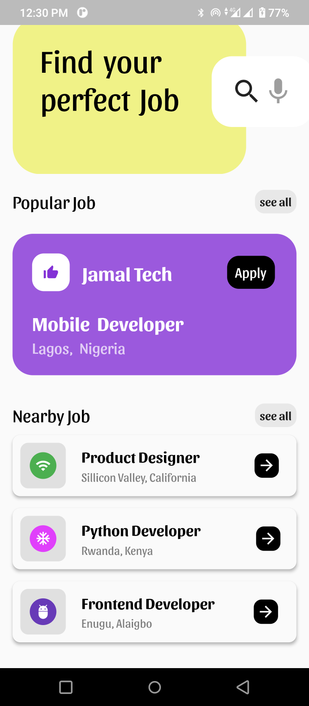
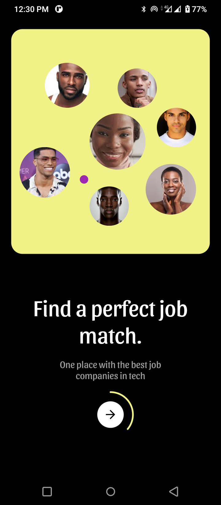
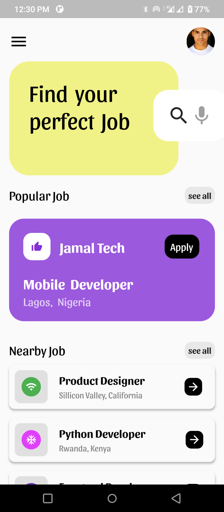

# Job Search App

A beautiful flutter UI developed by nonybrighto and designed by [Rafzin P](https://dribbble.com/shots/15674031-Job-Finder-App-Interactive)

## Overview

## Screenshots

Screenshots from the developed flutter application

| Home                                           | Display 1                                               | Display 2                                                |
| ---------------------------------------------- | ------------------------------------------------------- | -------------------------------------------------------- |
|  |  |  |

## Mentions

The UI is designed by Rafzin P. located [here](https://dribbble.com/shots/15674031-Job-Finder-App-Interactive)

For help getting started with Flutter, view it's
[online documentation](https://flutter.dev/docs), which offers tutorials,
samples, guidance on mobile development, and a full API reference.